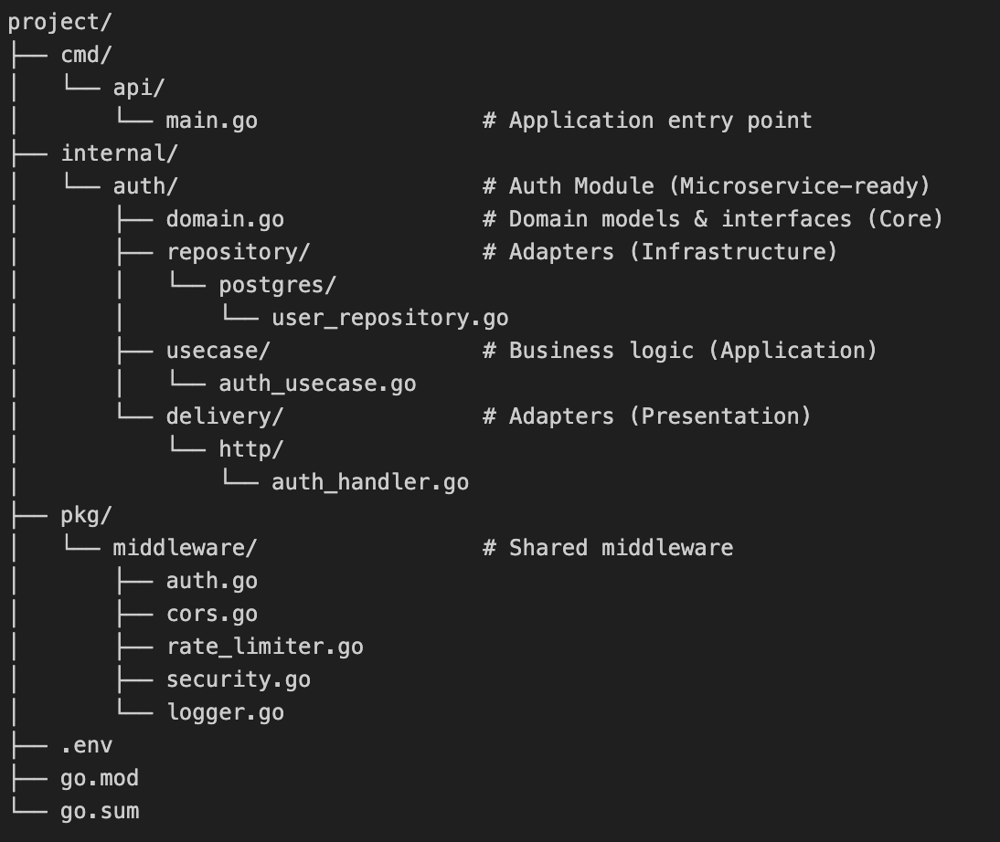

# Golang Gin Framework Boilerplate

## Project Description

**Project Name:** Golang Gin Framework Boilerplate

This project is a **modular, domain-driven backend system** built in **Go (Golang)** following the **Hexagonal Architecture (Ports and Adapters)** pattern.  
It provides a clean, maintainable foundation for building scalable microservices with clear separation of concerns across layers: **delivery**, **usecase**, **domain**, and **repository**.

The system uses the **Gin** web framework for HTTP delivery and integrates with a **PostgreSQL** database through **GORM**.  
It’s structured to support multiple independent modules — such as `auth`, `users`, `payments`, etc. — each self-contained and microservice-ready.

## Architecture Overview

The application is designed around **Hexagonal (Clean) Architecture**, ensuring:

- **Loose coupling** between business logic and external systems (DB, HTTP, etc.)
- **High testability** via clearly defined interfaces
- **Scalability** through modular design — each feature can evolve independently
- **Ease of maintenance** by enforcing domain-driven boundaries

### Flow of a Typical Request

HTTP Request → Router → Handler (Delivery)
→ Usecase (Business Logic)
→ Repository (DB Adapter)
→ PostgreSQL Database

Each layer depends **inward only**, meaning:
- The **domain** layer knows nothing about frameworks.
- The **usecase** layer only relies on **domain interfaces**.
- The **delivery** and **repository** layers act as **adapters** to the outside world.

---

## Folder Structure

### FLOW OVERVIEW
Here’s what happens step-by-step when a request (e.g. POST /login) hits your API:

1. cmd/api/main.go               → initializes Gin router, DI, routes
2. internal/auth/delivery/http/  → handler parses request, calls usecase
3. internal/auth/usecase/        → business logic runs
4. internal/auth/domain.go       → defines entities & interfaces
5. internal/auth/repository/     → concrete DB implementation
6. PostgreSQL                    → executes SQL query via GORM/pgx